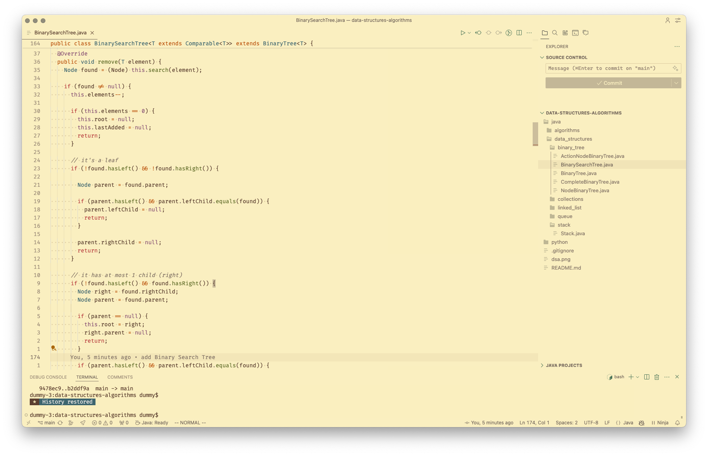

# Data Structures and Algorithms (DSA)

This repository contains implementations of various data structures and algorithms. The project is organized into different directories based on the programming language used for the implementation, and each directory contains subdirectories for data structures and algorithms.

## Project Structure

### Java

- **algorithms**: Contains implementations of various algorithms.
  - BinarySearch.java
  - MergeSort.java

- **data_structures**: Contains implementations of various data structures.
  - **binary_tree**: Contains classes related to binary trees.
    - Complete Binary Tree
    - Binary Search Tree
  - **linked_list**:
    - Doubly Linked List
  - **queue**
  - **stack**

### Python

- Placeholder for future Python implementations.

### Rust
- Placeholder for future Rust implementations.

## Correctness
Each implementation is tested for correctness using unit tests. 